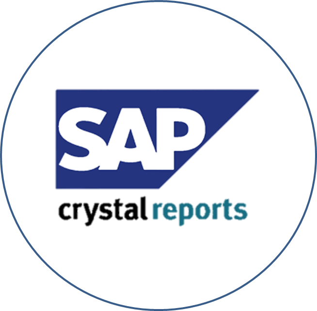

# Proiect - Programare Aplicatii Windows
### ~ Tema Proiectului: Prelucrari Statistice - Recensamantul Populatiei Romaniei 2022 ~
## 🛠️Instrumente folosite:

## [I.Descrierea cerintelor proiectului](https://github.com/Adriana-Giol/Proiect-Prelucrari-Statistice/blob/main/4.%20README/1.%20Descrierea%20Proiectului.md)
## [II.Prezentare vizuala proiect](https://github.com/Adriana-Giol/Proiect-Prelucrari-Statistice/blob/main/4.%20README/2.%20Prezentare%20Vizuala%20Proiect.md)
## [III.Resurse](https://github.com/Adriana-Giol/Proiect-Prelucrari-Statistice/blob/main/4.%20README/3.%20Resurse.md)

# Functionalitatile proiectului
## 1. UI - GUNA FRAMEWORK
## 2. Splash Screen 
## 3. Form Dashboard cu 3 User Controalere:
- Acasa
- Recenzati
- Recenzori
## 4. Meniu principal (in UC Recenzori si Recenzati)
- Salvare in fisier (TXT sau XML)
- Print (previzualizare si printare)
- Preluare date din fisier (TXT sau XML)
## 5. 

